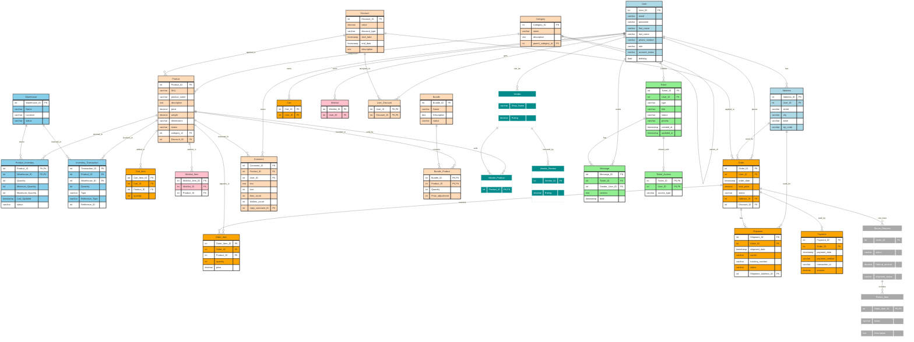

## Database Schema

```mermaid
erDiagram
    User {
        int User_ID PK
        varchar email
        varchar password
        varchar first_name
        varchar last_name
        varchar phone_number
        varchar role
        varchar account_status
        date birthday
    }

    Address {
        int Address_ID PK
        int User_ID FK
        varchar street
        varchar city
        varchar state
        varchar zip_code
    }

    Product {
        int Product_ID PK
        varchar SKU
        varchar product_name
        text description
        decimal price
        decimal weight
        varchar dimensions
        varchar status
        int category_id FK
        int Discount_ID FK
    }

    Category {
        int Category_ID PK
        varchar name
        text description
        int parent_category_id FK
    }

    Product_Inventory {
        int Product_ID PK, FK
        int Warehouse_ID PK, FK
        int Quantity
        int Minimum_Quantity
        int Maximum_Quantity
        timestamp Last_Updated
        varchar status
    }

    Warehouse {
        int Warehouse_ID PK
        varchar Name
        varchar Location
        varchar status
    }

    Inventory_Transaction {
        int Transaction_ID PK
        int Product_ID FK
        int Warehouse_ID FK
        int Quantity
        varchar Type
        varchar Reference_Type
        int Reference_ID
    }

    Cart {
        int Cart_ID PK
        int User_ID FK
    }

    Cart_Item {
        int Cart_Item_ID PK
        int Cart_ID FK
        int Product_ID FK
        int quantity
    }

    Wishlist {
        int Wishlist_ID PK
        int User_ID FK
    }

    Wishlist_Item {
        int Wishlist_Item_ID PK
        int Wishlist_ID FK
        int Product_ID FK
    }

    Order {
        int Order_ID PK
        int User_ID FK
        timestamp order_date
        decimal total_price
        varchar status
        int Address_ID FK
        int Discount_ID FK
    }

    Order_Item {
        int Order_Item_ID PK
        int Order_ID FK
        int Product_ID FK
        int quantity
        decimal price
    }

    Shipment {
        int Shipment_ID PK
        int Order_ID FK
        timestamp shipment_date
        varchar carrier
        varchar tracking_number
        varchar status
        int Shipment_Address_ID FK
    }

    Payment {
        int Payment_ID PK
        int Order_ID FK
        timestamp payment_date
        varchar payment_method
        varchar transaction_id
        decimal amount
    }

    Discount {
        int Discount_ID PK
        decimal value
        varchar discount_type
        timestamp start_date
        timestamp end_date
        text description
    }

    User_Discount {
        int User_ID PK, FK
        int Discount_ID PK, FK
    }

    Comment {
        int Comment_ID PK
        int Product_ID FK
        int User_ID FK
        text text
        int star
        int likes_count
        int dislikes_count
        int reply_comment_ID FK
    }

    Return_Request {
        int Return_ID PK
        int Order_ID FK
        int User_ID FK
        varchar status
        text Reason
        decimal Refund_amount
        varchar Tracking_Number
        varchar shipment_status
    }

    Return_Item {
        int Return_ID PK, FK
        int Order_Item_ID PK, FK
        int Quantity
        varchar status
        decimal Price_adjustment
        text Description
    }

    Bundle {
        int Bundle_ID PK
        varchar Name
        text Description
        varchar status
    }

    Bundle_Product {
        int Bundle_ID PK, FK
        int Product_ID PK, FK
        int Quantity
        int Price_adjustment
    }

    Vendor {
        int Vendor_ID PK, FK
        varchar Shop_Name
        text Description
        decimal Rating
        varchar status
    }

    Vendor_Product {
        int Vendor_ID PK, FK
        int Product_ID PK, FK
    }

    Vendor_Review {
        int Review_ID PK
        int Vendor_ID FK
        int User_ID FK
        decimal Rating
        text Comment
    }

    Ticket {
        int Ticket_ID PK
        int User_ID FK
        varchar type
        varchar title
        varchar status
        varchar priority
        timestamp created_at
        timestamp updated_at
    }

    Message {
        int Message_ID PK
        int Ticket_ID FK
        int Sender_User_ID FK
        text content
        timestamp date
    }

    Ticket_Access {
        int Ticket_ID PK, FK
        int User_ID PK, FK
        varchar access_type
    }

    %% Relationships
    User ||--o{ Address : has
    User ||--o{ Cart : owns
    User ||--o{ Wishlist : owns
    User ||--o{ Order : places
    User ||--o{ Comment : writes
    User ||--o{ Ticket : creates
    User ||--o{ Message : sends
    User ||--o{ Vendor : can_be
    User ||--o{ User_Discount : gets

    Address ||--o{ Order : used_for
    Address ||--o{ Shipment : used_for

    Category ||--o{ Product : categorizes
    Category ||--o{ Category : parent_of

    Product ||--o{ Cart_Item : added_to
    Product ||--o{ Wishlist_Item : wished_in
    Product ||--o{ Order_Item : appears_in
    Product ||--o{ Comment : reviewed_in
    Product ||--o{ Product_Inventory : stocked_in
    Product ||--o{ Bundle_Product : bundled_in
    Product ||--o{ Vendor_Product : sold_by
    Product ||--o{ Inventory_Transaction : involved_in

    Warehouse ||--o{ Product_Inventory : stores
    Warehouse ||--o{ Inventory_Transaction : involved_in

    Order ||--o{ Order_Item : contains
    Order ||--o{ Shipment : has
    Order ||--o{ Payment : paid_by
    Order ||--o{ Return_Request : can_have

    Discount ||--o{ Order : applied_to
    Discount ||--o{ Product : applied_to
    Discount ||--o{ User_Discount : assigned_to

    Return_Request ||--o{ Return_Item : includes

    Bundle ||--o{ Bundle_Product : contains

    Vendor ||--o{ Vendor_Product : sells
    Vendor ||--o{ Vendor_Review : reviewed_by

    Ticket ||--o{ Message : has
    Ticket ||--o{ Ticket_Access : shared_with

    %% Styling
    classDef LightBlue fill:#add8e6,stroke:#333,stroke-width:1px;
    classDef DarkCyan fill:#008b8b,stroke:#fff,stroke-width:1px,color:#fff;
    classDef Peach fill:#ffdab9,stroke:#333,stroke-width:1px;
    classDef SkyBlue fill:#87ceeb,stroke:#333,stroke-width:1px;
    classDef Orange fill:#ffa500,stroke:#333,stroke-width:1px;
    classDef DarkGray fill:#a9a9a9,stroke:#fff,stroke-width:1px,color:#fff;
    classDef Pink fill:#ffc0cb,stroke:#333,stroke-width:1px;
    classDef LightGreen fill:#90ee90,stroke:#333,stroke-width:1px;

    class User,Address LightBlue
    class Vendor,Vendor_Product,Vendor_Review DarkCyan
    class Product,Category,Comment,Discount,Bundle,Bundle_Product,User_Discount Peach
    class Product_Inventory,Warehouse,Inventory_Transaction SkyBlue
    class Cart,Cart_Item,Order,Order_Item,Payment,Shipment Orange
    class Return_Request,Return_Item DarkGray
    class Wishlist,Wishlist_Item Pink
    class Ticket,Message,Ticket_Access LightGreen
```
