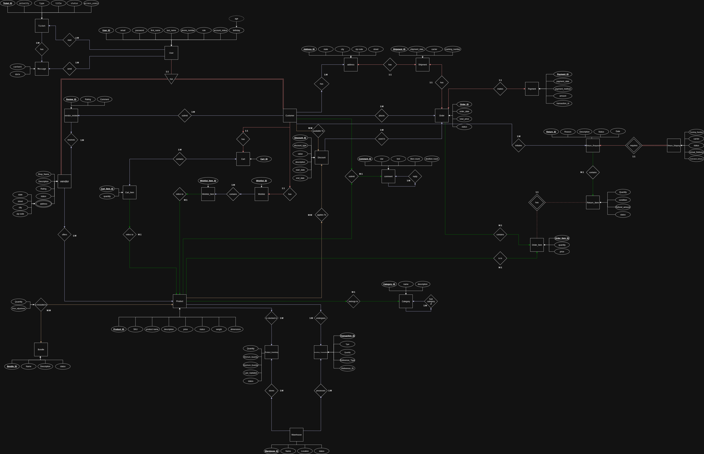

# E-commerce Shop

A comprehensive, full-featured e-commerce platform built with **Django** and **Django REST Framework** for the backend, and modern **HTML/CSS/JavaScript** for the frontend. This project provides a complete, scalable, and user-friendly solution for modern online retail.

## 🚀 Features

- **User Management**: Registration, authentication, profiles, and address management
- **Product Catalog**: Categories, products, bundles, discounts, and reviews
- **Shopping Cart**: Add/remove items, quantity management
- **Order Processing**: Complete order lifecycle from cart to delivery
- **Payment System**: Multiple payment methods with transaction tracking
- **Inventory Management**: Multi-warehouse inventory tracking
- **Vendor System**: Multi-vendor marketplace support
- **Customer Support**: Ticketing system for customer inquiries
- **Wishlist**: Save products for later purchase
- **Returns**: Complete return and refund process
- **RESTful API**: Comprehensive API for frontend integration

## 📁 Project Structure

```
├── code/              # Django backend source code
├── docs/              # Project documentation
├── frontend/          # HTML/CSS/JS frontend files
├── DBML/              # Database schema (DBML format)
├── ER/                # Entity-Relationship diagrams
└── README.md          # This file
```

## 🛠️ Technology Stack

**Backend:**
- Django 4.x
- Django REST Framework
- SQLite (development)
- JWT Authentication

**Frontend:**
- HTML5
- CSS3
- Vanilla JavaScript


## ⚡ Quick Start (with npm)

### Prerequisites

- Python 3.11 – 3.13
- Node.js 18+ (recommended: Node 20 LTS)
- npm
- Git

Check versions:
```bash
python3 --version
node -v
npm -v
git --version
```

---

### 1. Clone Repository

```bash
git clone https://github.com/MG-530/E-commerce-Shop-by-Django.git
cd E-commerce-Shop-by-Django
```

---

### 2. Backend Setup (Django)

Go to the backend directory:

```bash
cd backend
```

Create and activate virtual environment:

```bash
# Linux/macOS
python3 -m venv venv
source venv/bin/activate

# Windows
python -m venv venv
venv\Scripts\activate
```

Install dependencies:

```bash
pip install --upgrade pip
pip install -r requirements.txt
```

Apply migrations:

```bash
python manage.py makemigrations
python manage.py migrate
```

Create admin user (optional):

```bash
python manage.py createsuperuser
```

Run backend server:

```bash
python manage.py runserver
```

Backend API:

```
http://127.0.0.1:8000/
```

---

## 3. Frontend Setup (npm)

Open a new terminal and go to the frontend directory:

```bash
cd frontend
```

Install frontend dependencies:

```bash
npm install
```

Run development server:

```bash
npm run dev
```

Frontend will be available at:

```
http://localhost:3000
```

## 📚 API Documentation

The complete API documentation is available in the `docs/` folder:
- [`Backend_API_Documentation.md`](docs/Backend_API_Documentation.md) - Complete API reference
- [`Model_Documentation_by_Application.md`](docs/Model_Documentation_by_Application.md) - Database models documentation

### API Base URL
All API endpoints are prefixed with `/api/`

### Authentication
Protected endpoints require JWT token authentication:
```bash
Authorization: Token <your-jwt-token>
```

Get your token by posting to `/api/users/api-token-auth/` with email and password.

### Key Endpoints

| Module | Endpoint | Description |
|--------|----------|-------------|
| Auth | `POST /api/users/api-token-auth/` | User authentication |
| Users | `GET /api/users/users/` | User management |
| Products | `GET /api/catalog/products/` | Product catalog |
| Cart | `GET /api/orders/carts/` | Shopping cart |
| Orders | `GET /api/orders/orders/` | Order management |
| Wishlist | `GET /api/wishlist/items/` | User wishlist |

## 🗄️ Database Schema

The project uses a modular database design with the following main modules:

- **Users**: User accounts, profiles, and addresses
- **Catalog**: Products, categories, discounts, and reviews
- **Orders**: Shopping carts, orders, payments, and shipments
- **Inventory**: Warehouses and stock management
- **Vendors**: Multi-vendor marketplace features
- **Support**: Customer service ticketing system
- **Wishlist**: User product wishlists
- **Returns**: Product return and refund management

### 📊 Visual Database Schema

#### Entity-Relationship Diagram


**Interactive Versions:**
- 📝 [Editable Draw.io File](ER/ER_Diagram_V2.drawio)
- 🌐 [Open in Draw.io Online]()

#### Database Schema (DBML)
📊 **Interactive DBML Diagram:** [View on dbdiagram.io](https://dbdiagram.io/d)

To view the interactive schema:
1. Copy the contents of [`DBML/DBML.dbml`](DBML/DBML.dbml)
2. Paste it on [dbdiagram.io](https://dbdiagram.io/d) for interactive visualization

**Quick Schema Overview:**

```mermaid
erDiagram
    User {
        int User_ID PK
        varchar email
        varchar password
        varchar first_name
        varchar last_name
        varchar phone_number
        varchar role
        varchar account_status
        date birthday
    }

    Address {
        int Address_ID PK
        int User_ID FK
        varchar street
        varchar city
        varchar state
        varchar zip_code
    }

    Product {
        int Product_ID PK
        varchar SKU
        varchar product_name
        text description
        decimal price
        decimal weight
        varchar dimensions
        varchar status
        int category_id FK
        int Discount_ID FK
    }

    Category {
        int Category_ID PK
        varchar name
        text description
        int parent_category_id FK
    }

    Product_Inventory {
        int Product_ID PK, FK
        int Warehouse_ID PK, FK
        int Quantity
        int Minimum_Quantity
        int Maximum_Quantity
        timestamp Last_Updated
        varchar status
    }

    Warehouse {
        int Warehouse_ID PK
        varchar Name
        varchar Location
        varchar status
    }

    Inventory_Transaction {
        int Transaction_ID PK
        int Product_ID FK
        int Warehouse_ID FK
        int Quantity
        varchar Type
        varchar Reference_Type
        int Reference_ID
    }

    Cart {
        int Cart_ID PK
        int User_ID FK
    }

    Cart_Item {
        int Cart_Item_ID PK
        int Cart_ID FK
        int Product_ID FK
        int quantity
    }

    Wishlist {
        int Wishlist_ID PK
        int User_ID FK
    }

    Wishlist_Item {
        int Wishlist_Item_ID PK
        int Wishlist_ID FK
        int Product_ID FK
    }

    Order {
        int Order_ID PK
        int User_ID FK
        timestamp order_date
        decimal total_price
        varchar status
        int Address_ID FK
        int Discount_ID FK
    }

    Order_Item {
        int Order_Item_ID PK
        int Order_ID FK
        int Product_ID FK
        int quantity
        decimal price
    }

    Shipment {
        int Shipment_ID PK
        int Order_ID FK
        timestamp shipment_date
        varchar carrier
        varchar tracking_number
        varchar status
        int Shipment_Address_ID FK
    }

    Payment {
        int Payment_ID PK
        int Order_ID FK
        timestamp payment_date
        varchar payment_method
        varchar transaction_id
        decimal amount
    }

    Discount {
        int Discount_ID PK
        decimal value
        varchar discount_type
        timestamp start_date
        timestamp end_date
        text description
    }

    User_Discount {
        int User_ID PK, FK
        int Discount_ID PK, FK
    }

    Comment {
        int Comment_ID PK
        int Product_ID FK
        int User_ID FK
        text text
        int star
        int likes_count
        int dislikes_count
        int reply_comment_ID FK
    }

    Return_Request {
        int Return_ID PK
        int Order_ID FK
        int User_ID FK
        varchar status
        text Reason
        decimal Refund_amount
        varchar Tracking_Number
        varchar shipment_status
    }

    Return_Item {
        int Return_ID PK, FK
        int Order_Item_ID PK, FK
        int Quantity
        varchar status
        decimal Price_adjustment
        text Description
    }

    Bundle {
        int Bundle_ID PK
        varchar Name
        text Description
        varchar status
    }

    Bundle_Product {
        int Bundle_ID PK, FK
        int Product_ID PK, FK
        int Quantity
        int Price_adjustment
    }

    Vendor {
        int Vendor_ID PK, FK
        varchar Shop_Name
        text Description
        decimal Rating
        varchar status
    }

    Vendor_Product {
        int Vendor_ID PK, FK
        int Product_ID PK, FK
    }

    Vendor_Review {
        int Review_ID PK
        int Vendor_ID FK
        int User_ID FK
        decimal Rating
        text Comment
    }

    Ticket {
        int Ticket_ID PK
        int User_ID FK
        varchar type
        varchar title
        varchar status
        varchar priority
        timestamp created_at
        timestamp updated_at
    }

    Message {
        int Message_ID PK
        int Ticket_ID FK
        int Sender_User_ID FK
        text content
        timestamp date
    }

    Ticket_Access {
        int Ticket_ID PK, FK
        int User_ID PK, FK
        varchar access_type
    }

    %% Relationships
    User ||--o{ Address : has
    User ||--o{ Cart : owns
    User ||--o{ Wishlist : owns
    User ||--o{ Order : places
    User ||--o{ Comment : writes
    User ||--o{ Ticket : creates
    User ||--o{ Message : sends
    User ||--o{ Vendor : can_be
    User ||--o{ User_Discount : gets

    Address ||--o{ Order : used_for
    Address ||--o{ Shipment : used_for

    Category ||--o{ Product : categorizes
    Category ||--o{ Category : parent_of

    Product ||--o{ Cart_Item : added_to
    Product ||--o{ Wishlist_Item : wished_in
    Product ||--o{ Order_Item : appears_in
    Product ||--o{ Comment : reviewed_in
    Product ||--o{ Product_Inventory : stocked_in
    Product ||--o{ Bundle_Product : bundled_in
    Product ||--o{ Vendor_Product : sold_by
    Product ||--o{ Inventory_Transaction : involved_in

    Warehouse ||--o{ Product_Inventory : stores
    Warehouse ||--o{ Inventory_Transaction : involved_in

    Order ||--o{ Order_Item : contains
    Order ||--o{ Shipment : has
    Order ||--o{ Payment : paid_by
    Order ||--o{ Return_Request : can_have

    Discount ||--o{ Order : applied_to
    Discount ||--o{ Product : applied_to
    Discount ||--o{ User_Discount : assigned_to

    Return_Request ||--o{ Return_Item : includes

    Bundle ||--o{ Bundle_Product : contains

    Vendor ||--o{ Vendor_Product : sells
    Vendor ||--o{ Vendor_Review : reviewed_by

    Ticket ||--o{ Message : has
    Ticket ||--o{ Ticket_Access : shared_with

    %% Styling
    classDef LightBlue fill:#add8e6,stroke:#333,stroke-width:1px;
    classDef DarkCyan fill:#008b8b,stroke:#fff,stroke-width:1px,color:#fff;
    classDef Peach fill:#ffdab9,stroke:#333,stroke-width:1px;
    classDef SkyBlue fill:#87ceeb,stroke:#333,stroke-width:1px;
    classDef Orange fill:#ffa500,stroke:#333,stroke-width:1px;
    classDef DarkGray fill:#a9a9a9,stroke:#fff,stroke-width:1px,color:#fff;
    classDef Pink fill:#ffc0cb,stroke:#333,stroke-width:1px;
    classDef LightGreen fill:#90ee90,stroke:#333,stroke-width:1px;

    class User,Address LightBlue
    class Vendor,Vendor_Product,Vendor_Review DarkCyan
    class Product,Category,Comment,Discount,Bundle,Bundle_Product,User_Discount Peach
    class Product_Inventory,Warehouse,Inventory_Transaction SkyBlue
    class Cart,Cart_Item,Order,Order_Item,Payment,Shipment Orange
    class Return_Request,Return_Item DarkGray
    class Wishlist,Wishlist_Item Pink
    class Ticket,Message,Ticket_Access LightGreen
```



### 📁 Schema Files
- [`DBML/DBML.dbml`](DBML/DBML.dbml) - Complete database markup language file
- [`ER/ER_Diagram_V2.drawio`](ER/ER_Diagram_V2.drawio) - Entity-relationship diagram source

## 🤝 Contributing

1. Fork the repository
2. Create a feature branch (`git checkout -b feature/amazing-feature`)
3. Commit your changes (`git commit -m 'Add amazing feature'`)
4. Push to the branch (`git push origin feature/amazing-feature`)
5. Open a Pull Request

## 📄 License

This project is open source and available under the [MIT License](LICENSE).

## 📞 Support

For support and questions:
- Check the documentation in the `docs/` folder
- Create an issue in the repository
- Contact the development team

---

**Note**: This is a development/testing environment. Please configure appropriate security settings before deploying to production.